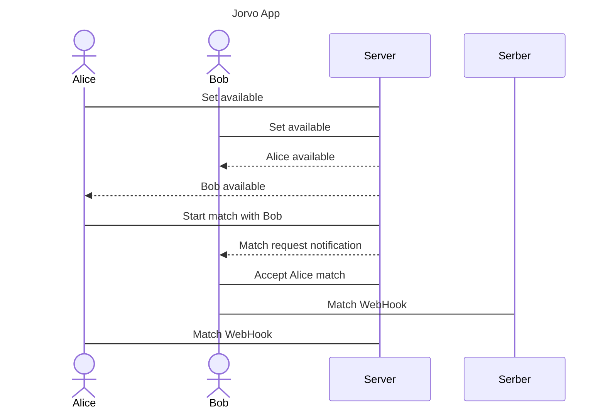

# Jorvo

[My Notes](notes.md)

This is a platform to race type against your friends and other strangers in real time

## 🚀 Specification Deliverable

For this deliverable I did the following. I checked the box `[x]` and added a description for things I completed.

- [x] Proper use of Markdown
- [x] A concise and compelling elevator pitch
- [x] Description of key features
- [x] Description of how you will use each technology
- [x] One or more rough sketches of your application. Images must be embedded in this file using Markdown image references.

### Elevator pitch

Typing quickly and accurately is one of the most increasingly important skills for anyone in almost any industry. There are many websites to practice and measure your typing speed, put you are always only comparing your speed either with yourself. Plus everyone knows that multiplayer games are more fun than single player games. Welcome to Jorvo.

### Design

The web app design will be simple yet fun with lots of personality. There will be a home page, a challenge page, and a log page, and a single player page. 

### Key features

- A user can make an account and add their friends accounts
- Users can challenge their friends to a race which puts both users against eachother typing the same quote
- Both users will be able to see each others progress in real time
- The user will have access to past games

### Technologies

I am going to use the required technologies in the following ways.

- **HTML** - Structure basic layout of all of the pages including auth, and friends and games dashboard
- **CSS** - Set a consistent pallet for colors and reusable, responsive designs 
- **React** - React will be used for building the forms for and updating the match between users in real time
- **Service** - Backend service with endpoints for:
  - Authentication
  - Requesting/accepting friend invites
  - Creating matches
  - Reading match stats
- **DB/Login** - Store users, relationships, match results
- **WebSocket** - Create a websocket connection between users for the matches
- **3rd Party API** - Use a quotes api as the text that is typed between users

## 🚀 AWS deliverable

For this deliverable I did the following. I checked the box `[x]` and added a description for things I completed.

- [x] **Server deployed and accessible with custom domain name** - [My server link](https://jorvo.link).

## 🚀 HTML deliverable

For this deliverable I did the following. I checked the box `[x]` and added a description for things I completed.

- [x] **HTML pages** 
- [x] **Proper HTML element usage** 
- [x] **Links** 
- [x] **Text** 
- [x] **3rd party API placeholder** 
- [x] **Images** 
- [x] **Login placeholder** 
- [x] **DB data placeholder** 
- [x] **WebSocket placeholder** 

## 🚀 CSS deliverable

For this deliverable I did the following. I checked the box `[x]` and added a description for things I completed.

- [x] **Header, footer, and main content body** 
- [x] **Navigation elements** 
- [x] **Responsive to window resizing** 
- [x] **Application elements** 
- [x] **Application text content** 
- [x] **Application images** 

## 🚀 React part 1: Routing deliverable

For this deliverable I did the following. I checked the box `[x]` and added a description for things I completed.

- [x] **Bundled using Vite** - 
- [x] **Components** - 
- [x] **Router** - 

## 🚀 React part 2: Reactivity deliverable

For this deliverable I did the following. I checked the box `[x]` and added a description for things I completed.

- [x] **All functionality implemented or mocked out** - I implemented some fake data for the home page to display the data from games as soon as the db is hooked up. I also simulated an authentication system using async/await functionality and Promises. 
- [x] **Hooks** - I used useEffect to use the setUser function from the useState hook from the localStorage. This made it so rendering the app doesn't cause an infinite loop what setting the user from local storage. 

## 🚀 Service deliverable

For this deliverable I did the following. I checked the box `[x]` and added a description for things I completed.

- [x] **Node.js/Express HTTP service** - I made a bunch of express services
- [x] **Static middleware for frontend** - Done
- [x] **Calls to third party endpoints** - Done. Calls a free quote api
- [x] **Backend service endpoints** - Done. endpoints for Users, Friends, and Matches
- [x] **Frontend calls service endpoints** - Done. Api calls for each service
- [x] **Supports registration, login, logout, and restricted endpoint** - Done

## 🚀 DB deliverable

For this deliverable I did the following. I checked the box `[x]` and added a description for things I completed.

- [x] **Stores data in MongoDB** - Done. Moved storage for Friends, Matches, and Users to DB from backend server.
- [x] **Stores credentials in MongoDB** - Done. All credentials including keys stored in Mongo

## 🚀 WebSocket deliverable

For this deliverable I did the following. I checked the box `[x]` and added a description for things I completed.

- [x] **Backend listens for WebSocket connection** - The backend listens for when someone starts a match
- [x] **Frontend makes WebSocket connection** - The match is initiated by the frontend client
- [x] **Data sent over WebSocket connection** - The client's progress is sent over the websocket
- [x] **WebSocket data displayed** - the oppenent's progress is sent over the web socket
- [x] **Application is fully functional** - It completely functions, with bugs here and there. 
